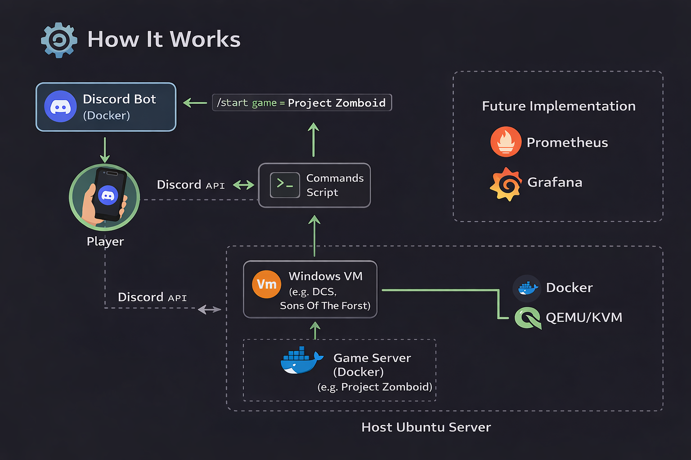
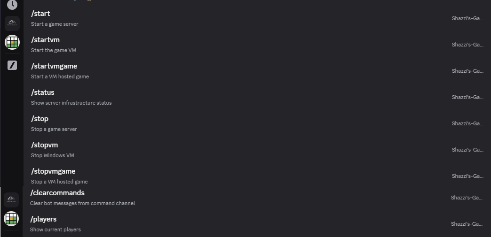
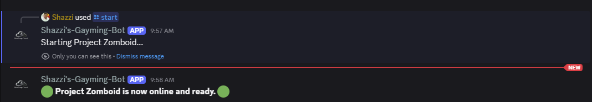
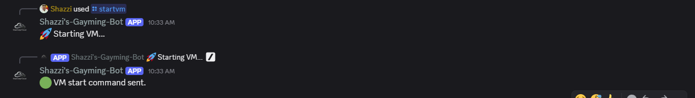
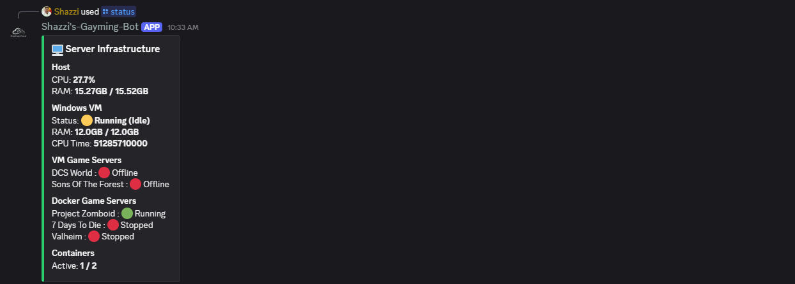

# 🚀 Self-Hosted Game Server Platform

A fully automated, self-hosted multiplayer game server platform built using Docker, virtualisation, and Discord integration.

---

## 🎯 Overview

This project provides a centralised system for hosting and managing multiple game servers on demand.

Users can start and stop servers directly from Discord, while the system automatically shuts down idle servers to conserve resources.

---

## 🏗️ Architecture

- **Docker Containers**
  - Project Zomboid
  - Valheim
  - 7 Days to Die

- **Windows VM (KVM/QEMU)**
  - DCS World Server
  - Sons of the Forest

- **Discord Bot (Python)**
  - Server start/stop commands
  - Player monitoring
  - Idle shutdown automation
  - Status reporting

---

## ⚙️ Features

### 🎮 Multi-Game Support
- Multiple dedicated game servers running in containers and VM

### 🤖 Discord Automation
- Start/stop servers via commands
- Real-time player monitoring
- Automated notifications

### ⏱️ Smart Resource Management
- Auto shutdown when servers are empty
- Reduces unnecessary CPU/RAM usage

### 🌐 Networking
- Domain + port forwarding
- LAN + public access
- Secure remote access

### 💾 Persistent Storage
- Game data stored on host filesystem
- Survives restarts and updates

### 🔄 Automated Updates
- SteamCMD integration for server updates

---

## 📁 Project Structure
- bot/ # Discord bot + automation
- zomboid/ # Zomboid Docker setup
- valheim/ # Valheim Docker setup
- 7days2die/ # 7DTD Docker setup
- scripts/ # Automation + maintenance scripts
- vm/ # Windows VM documentation
- automation/ # Cron jobs (optional)

---

## 🧠 Key Concepts

- Containerisation (Docker)
- Virtualisation (KVM/QEMU)
- Automation (Discord bot + scripts)
- Networking (ports, routing, remote access)
- Infrastructure as Code

---

## ⚠️ Notes

- Game files are not included (SteamCMD required)
- VM images are not included
- Secrets and environment variables are excluded

---

## 📌 Summary

This project demonstrates a fully automated, self-hosted game infrastructure capable of dynamically managing multiple multiplayer servers with minimal manual intervention.

## 🖼️ Screenshots

### ⚙️ Architecture-Diagram

### 🎮 Discord Bot Commands

### ▶️ Starting aDocker game container

### ⚙️ Server Startup

### 🟢 Server Status

